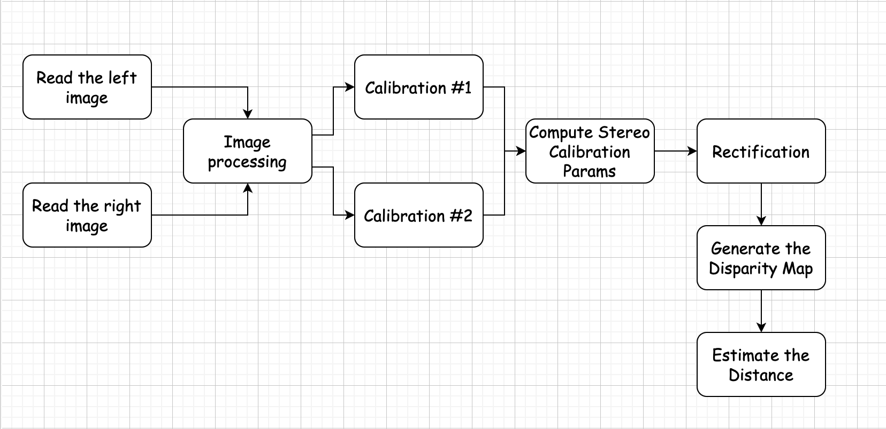

# Distance Estimation based on Stereo Cameras

This project mainly perform how to use two cameras to perform stereo camera calibration and distance estimation

## Introduction

**Goal** &emsp; Implement a pipeline estimating the distance to a fixed object of known distance using ROS bag files containing stereo images and two YAML files containing left and right cameras' parameters

**Input** &emsp; There are four expected inputs:
-   bag files (ends with .bag). For this project, I use the .bag files that contains compressed JPEG images (byte array in string format). The left and right images are stored under the topic '/left/image_raw/compressed' and '/right/image_raw/compressed'

-   stereo camera YAML files containing the left and right camera parameters for these bag files. The parameters include width and height of the images, camera name, camera matrix, distortion model, distortion coefficients, rectification matrix, rectification matrix, and projection matrix. For each matrix, it contains three sub-params: rows, cols, and data. Rows and cols are integers, and data is an array (not np.array)

-   corresponding object bounding box or mask in format (xmin, ymin, xmax, ymax)

-   do you use chessboard as a reference in the input images? This should be either 'y' or 'n', representing 'yes' and 'no'.

**Output** &emsp; The estimated distance of the bounding box to camera.

## Data
For this project, the database is a .bag file. It may contain multiple topics. However, this project only demands to read information from '/left/image raw/compressed' and '/right/image raw/compressed'. The images are stored as bytes string type. Hence, we need to convert it to .jpeg format. I use python function BytesIO to perform such conversion and use Pillow library to read the images.

## Estimation Pipeline Design
The pipeline is designed as the following: after pre-processing the left and right images, they are fed to the calibration algorithm. The calibration algorithm can perform stereo camera calibration. Usually we can use a chessboard as a reference to calibrate the camera, but in some cases we don't have a chessboard. Hence, in this project, I also provide the strategy using SIFT to perform stereo camera calibration. The calibration algorithm can compute the rotation matrix $R$ and the translation matrix $t$. Then we can use $R$ and $t$ to perform rectification algorithm. The rectificated images are used to generate the disparity map, and hence, we can estimate the distance. The graph of the pipeline is shown blow:

## Note
Due to the Github limitation, copy right and privacy protection, I will not provide the dataset or any sample input parameters.

## Acknowledgement
Thanks for Stephane VUJASINOVIC and Frederic UHRWEILLER provided the formula to calculate the distance from a disparity map. 
